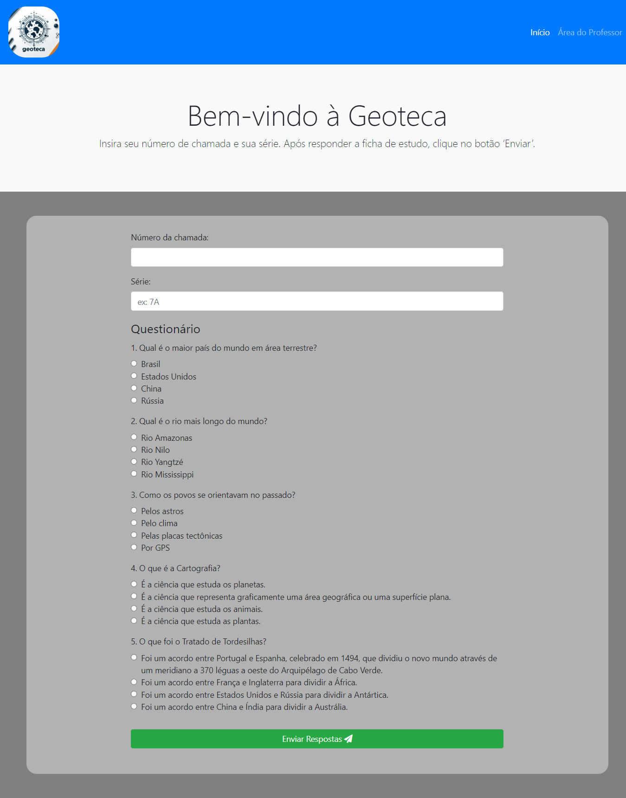

# Projeto Integrador I Grupo 014

Este trabalho apresenta o desenvolvimento de “Geoteca”, um website para registro de fichas de estudos de conteúdos de geografia. O objetivo é melhorar a aplicação de testes estilo questionário em uma escola fundamental, facilitando o registro dos alunos e auxiliando o feedback dos docentes. A metodologia adotada envolveu ouvir e interpretar o contexto escolar, criar e prototipar a solução, e implementar e testar o sistema. A solução inicial foi desenvolvida usando HTML, CSS, JavaScript e Bootstrap para o front-end, Node.js para o back-end, e SQL para o Banco de dados.

<br>

## Integrantes do Projeto

### • [Eduardo Guerts](https://github.com/EduardoGuerts)

### • [Leandro Rui](https://github.com/segueorui)

### • [Luana Tacuatia](https://github.com/luana-tacuatia)

### • [Marcelo Gigliotti]()

### • [Mauri Junior](https://github.com/maurijr1)

<br>

## Implantações
### GitHub Pages
https://eduardoguerts.github.io/Projeto-Integrador-I-Grupo-014/

### Vercel
https://projeto-integrador-i-grupo-014.vercel.app/index.html

<br>

## Banco de Dados

```sql

-- Tabela Aluno com numero da chamada como chave primária e campo serie
CREATE TABLE aluno (
    chamada INT PRIMARY KEY,
    serie VARCHAR(10)
);

-- Tabela Professor com usuario e senha
CREATE TABLE professor (
    usuario VARCHAR(50) PRIMARY KEY,
    senha VARCHAR(50)
);

-- Tabela Ficha com campos adicionais
CREATE TABLE ficha (
    id INT PRIMARY KEY,
    gravura VARCHAR(100),
    pergunta VARCHAR(255),
    disciplina VARCHAR(50),
    texto_chave VARCHAR(255)
);

-- Tabela Respostas com chave estrangeira para Ficha
CREATE TABLE respostas (
    id INT PRIMARY KEY,
    id_pergunta INT,
    resposta VARCHAR(255),
    correta BOOL,
    FOREIGN KEY (id_pergunta) REFERENCES ficha(id)
);

-- Tabela Avaliacao com chave estrangeira para Aluno
CREATE TABLE avaliacao (
    id INT PRIMARY KEY,
    id_aluno INT,
    FOREIGN KEY (id_aluno) REFERENCES aluno(RA)
);

-- Tabela Questao com chave estrangeira para Ficha e Avaliacao, e campo acertou
CREATE TABLE questao (
    id INT PRIMARY KEY,
    id_ficha INT,
    id_avaliacao INT,
    acertou BOOL,
    FOREIGN KEY (id_ficha) REFERENCES ficha(id),
    FOREIGN KEY (id_avaliacao) REFERENCES avaliacao(id)
);

```

<br>

## Imagens
<p align="center">
  
</p>
